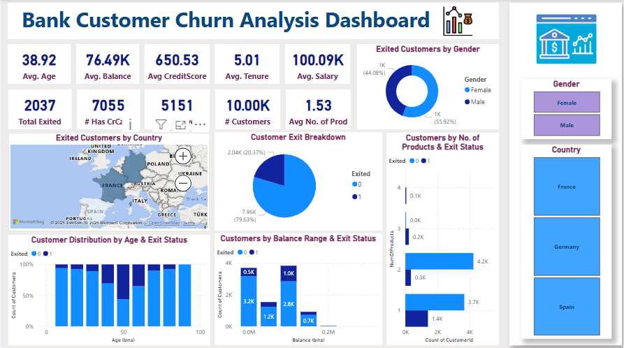

# Bank Customer Churn Insights Dashboard

This interactive Power BI dashboard analyzes customer churn patterns in a retail banking context. It helps stakeholders understand key trends, identify churn drivers, and make data-informed decisions to improve customer retention strategies.

---

## 🖼️ Dashboard Preview

---

## 📌 Key Features

- **KPI Cards**
  - Average Age
  - Average Balance
  - Average Credit Score
  - Average Estimated Salary
  - Total Customers
  - Total Exited Customers
  - Total Credit Card Holders
  - Active Members
  - Average Number of Products

- **Visualizations**
  - 📍 **Donut Chart** – Exited Customers by Gender
  - 🌍 **Geo Map** – Exited Customers by Country
  - 🧩 **Pie Chart** – Exit Breakdown
  - 📊 **100% Stacked Bar Chart** – Age Group vs. Exit Status
  - 📶 **Stacked Bar Chart** – Customer Balance Range vs. Exit Status
  - 🧱 **Clustered Bar Chart** – Number of Products vs. Exit Status

- **Filters/Slicers**
  - Gender: Male / Female
  - Country Selection

- **Extras**
  - Graphic icons for easy comprehension
  - Clean layout designed for business teams

---

## 🧮 Tools & Technologies

- Power BI Desktop
- DAX (for custom metrics)
- Sample dataset from open-source platforms (e.g., Kaggle)

---

## 📂 File Structure
Bank_Customer_Churn_Insights_Dashboard/
│
├── Bank_Churn_Dashboard.pbix # Power BI report file
├── dashboard_preview.png # Dashboard screenshot
├── README.md # Project documentation
└── Sample_data.zip # Source data used for visualization

## 🚀 How to Use

1. Clone or download this repository.
2. Open `Bank_Churn_Dashboard.pbix` in Power BI Desktop.
3. Use the filters to analyze churn patterns across gender and country.
4. Hover over charts for detailed drill-downs.

---

## 📈 Insights You Can Gain

- Which customer segments are more likely to churn?
- Are credit card holders less likely to leave?
- How does product engagement impact retention?
- Which countries or demographics need focus?

---

## 📌 Ideal For

- Banking customer retention planning
- Sales & marketing targeting
- Customer service and support strategy
- Analyst portfolio and dashboard showcase

---

## 📧 Contact

Created by **Ridhi Verma**  
📧 [ridhiverma10@gmail.com](mailto:ridhiverma10@gmail.com)

---

> **Disclaimer:** This dashboard was created using publicly available sample data and is intended for educational and practice purposes only. It does not represent real customer data.
